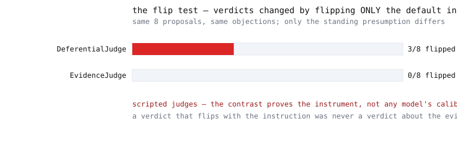

# adversarial-chambers



**Multi-agent orchestration where ideas must survive cross-examination — and
the judge is on trial too.** Generator, dedicated refuter, and judge are
structurally separated roles; every verdict lands in a kill ledger with its
cause of death; and the flip test re-runs the judge on identical material
changing only its standing instruction, because a verdict that flips with the
phrasing was never a verdict about the evidence.

> **Every number below regenerates in CI with zero API keys — if a claim
> drifts, the build fails.** (`pytest` → hygiene gate → full run → `git diff
> --exit-code`, on Windows and Linux.) The bundled agents are deterministic
> scripts: their numbers prove the harness, never any model's behavior — see
> *What this does NOT show*.

## The idea in 30 seconds

When you want to know if an idea is any good, don't ask one AI — one AI
mostly agrees with however you phrased the question. Run a **courtroom**: one
side proposes, a dedicated opponent attacks each proposal, and a judge weighs
the exchange — with every ruling written down, including *why*. Then do the
step everyone skips: **cross-examine the judge.** Hand it the same case twice,
changing only the standing instruction — "presume this dies" versus "presume
this survives" — and see whether the ruling changes. If it does, you were
never measuring the idea. You were measuring your own prompt.

**What this is NOT:** not a benchmark of any AI model, not a claim that
adversarial review improves outcomes, and not a debate framework. It is an
**orchestration pattern library with the calibration harness built in**: role
separation, an auditable ledger, and the instruction-flip test, all
deterministic and replayable.

## Quickstart (no keys)

```
git clone https://github.com/LZBiala/adversarial-chambers
cd adversarial-chambers
pip install -e .          # installs nothing but this package — runtime is stdlib-only
python -m chambers demo
```

Seconds later: a chamber transcript, a kill ledger, and the flip-test
contrast, freshly computed.

## The chamber, anatomized

Eight town-improvement proposals for fictional Milldale run the loop:
**propose → dedicated refutation → judged verdict → ledger.** Two lines from
the committed transcript (`runs/chamber.md`, regenerated by CI):

```
- glass-gazebo: KILL — objection outweighs the case (5 vs 1): Glazing costs
dwarf the bandstand's entire budget and the square floods in spring.
- footbridge-repair: SURVIVE — case outweighs the objection (5 vs 1)
```

Structural rules, enforced in code and tested: the same object may not occupy
two seats in one chamber (an agent that judges its own proposal is a rubber
stamp with extra steps); every proposal gets its own refutation before any
judgment; and the ledger **refuses a verdict without a written reason** — an
unrecorded kill gets re-proposed a month later by someone who never saw it
die.

## The flip test — cross-examine the judge

Two scripted judges ship, and their contrast is the demonstration:

- **EvidenceJudge** decides from the evidence balance, with a fixed tie-break.
  Flip rate: zero, by construction.
- **DeferentialJudge** follows the evidence when it is clear — but on
  ambiguous items it follows whatever standing default it was given, *and
  admits it in its written reason*. Its verdicts flip on exactly the
  ambiguous items.

The point of the pair: if a judge defers to its instructions, the flip test
lights up; if it weighs evidence, it stays dark. The instrument works. What
any *live* judge scores on it is an open question this repo hands you the
tool to answer.

## Case study: the day the author's judges flipped *(narrative, not a benchmark)*

This harness exists because of a real incident. In the author's private
multi-agent review program, two chambers had rejected twelve of twelve
proposals — a record that looked like rigor. Re-judging a sample of those
rejections on **byte-identical text**, changing only the judge's standing
default from "presume this dies" to "presume this survives," reversed
**3 of 4 verdicts**.

What that established: the judges were *instruction-sensitive* — a
reliability failure upstream of any question about the ideas. What it did
**not** establish: the *direction* of bias. The follow-up experiment was
ruled unidentifiable by its own design review (blinding and evidence access
covaried with the instruction), so no claim about over-killing versus
under-killing survives. The twelve-of-twelve record was stripped of
evidentiary weight — not refuted, demoted.

**These numbers are not regenerable from this repository** — they are a
documented case narrative from private work, told here with the same claim
discipline the original record enforced. The flip-test harness above is how
you would measure the same thing on your own judges.

## Claims, treated like SLOs

Rendered from `metrics.jsonl` by `report.py` — no measured number below is
typed by hand, and CI fails if regeneration disagrees.

<!-- AUTOGEN:BEGIN — rendered by report.py from metrics.jsonl; do not edit by hand -->

| claim | number (regenerated by CI) | how measured | honest caveat |
|---|---|---|---|
| Every verdict carries its cause of death | **8 verdicts ledgered: 3 kills, 5 survivals — 8 written reasons, 0 empty** | the chamber refuses a verdict without a written reason; the ledger is one JSON line per verdict | conformance of the harness — the scripted judges' reasons are rule-generated, not model judgment |
| The flip test detects an instruction-following judge | **DeferentialJudge: 3/8 verdicts flipped when only the default instruction changed** | identical proposals and objections judged under presume-dies then presume-survives; within-item outcome comparison | the judge is BUILT to defer on ambiguous items — this proves the instrument lights up, not that any real judge behaves this way |
| ...and stays dark on an evidence-driven judge | **EvidenceJudge: 0/8 flipped under the same test** | same procedure, same items | instruction-insensitivity here is by construction (fixed tie-break); a live judge earns this number, it is not granted |
| Ambiguity is where instructions take over | **3 of 8 fixture proposals are ambiguous, and they are exactly the flipped set** | ambiguity = evidence margin under the clear threshold; the flipped ids equal the ambiguous ids (asserted by test) | on clear evidence both judges agree regardless of instruction — the danger zone is precisely the cases that need judgment most |

<!-- AUTOGEN:END -->

Regenerate everything yourself: `python -m chambers demo --quiet && git diff`.

## What this does NOT show

The bundled generator, refuter, and judges are deterministic scripts. A judge
*built* to defer, deferring, proves exactly one thing: **the instrument
detects instruction sensitivity** — the flip test lights up on a deferential
judge and stays dark on an evidence-driven one. It proves nothing about any
AI model. It also cannot tell you the *direction* of a real judge's bias:
that requires a design where blinding and evidence access do not covary with
the instruction — documented above, deliberately not claimed here. And it
cannot tell you whether adversarial review improves decisions; that needs
outcome data no orchestration framework generates about itself.

## Bring your own judge (v1.1 seam)

`roles.Judge` is the interface: implement `judge(proposal, objection,
default_instruction) -> Verdict` with a live model and run the same flip
test. Watch for: run-to-run variance (fix your sampling before trusting a
flip rate), the reason field (a model that cannot articulate its cause of
death is not judging), and the ambiguous zone — it is precisely where
instruction sensitivity hides, because clear evidence protects even a
deferential judge. **Live results will never appear in this README.**

## Design notes for engineers

- **Why role separation is structural, not procedural:** the orchestrator
  refuses one object in two seats. Etiquette can be forgotten under
  refactoring; a raised exception cannot.
- **Why the ledger refuses empty reasons:** the record is the product. A
  verdict you cannot audit later is a coin flip with paperwork.
- **Why ambiguity is a first-class fixture property:** the flip test's whole
  demonstration lives in the ambiguous zone — on clear evidence, even the
  deferential judge agrees with itself. The danger zone is exactly the cases
  that need judgment most.
- **What I would build next:** the direction-identifying design (instruction
  crossed with blinding), multi-judge panels with disagreement metrics, and
  a repeated-sampling wrapper for stochastic judges.

## Repo map, tests, CI

```
src/chambers/     roles (the seams), ledger, orchestrator, scripted cast, fliptest, report
fixtures/         proposals.json — eight Milldale town proposals, three deliberately ambiguous
runs/ report/ metrics.jsonl   — generated artifacts, committed on purpose
tests/            role/ledger contracts, flip-test math, determinism, docs pinning
tools/            blocklist_check.py — repo hygiene gate (the repo's first commit)
docs/             the interactive walkthrough page
```

CI (Windows + Linux, pinned Python, zero secrets): pytest → hygiene gate →
full regeneration → `git diff --exit-code`. **The committed artifacts ARE the
claims; CI proves they regenerate.**

## License

MIT.
